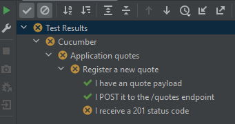

# quotes-exemple
Mise en oeuvre d'une api avec Springboot et d'un client de test BDD avec Cucumber.

Avec OpenApi generator, génération à partir d'un fichier OpenAPI "quotes.yaml" :
 - Des intertaces et des DTO pour Springboot.
 - D'un client et des DTO pour le client BDD.
 
 ## Installation et utilisation avec IntelliJ
  - Git clone de ce repository et import sous IntelliJ du projet (maven) qui contient 2 modules : quotes-api pour Springboot
 et quotes-spec pour le client BDD.
  - Affectation d'un Java JDK 17 (File / Project structure / Project /SDK.

 ### quotes-api
  - Génération du dossier target avec "maven clean package" (fenêtre Maven, quotes-exemple/quotes-api/Lifecycle, ou alors directement en ligne de commande en étant au niveau du fichier pom à exploiter).
    
    ```
    [INFO] ------------------------------------------------------------------------
    [INFO] BUILD SUCCESS
    [INFO] ------------------------------------------------------------------------
    [INFO] Total time:  12.396 s
    [INFO] Finished at: 2023-01-15T08:56:03+01:00
    [INFO] ------------------------------------------------------------------------
    ```

  - Déclaration "Generated Source Root" du dossier target/generated-sources/openapi/src/main/java 
    via le menu contextuel et "Mark directory as" sur ce dossier.
  - Lancement du main Springboot (Swagger2SpringBoot).
  - L'interface utilisateur swagger-ui est accessible à http://localhost:9090/api.
  - La base de donnée H2 est accessible à http://localhost:9090/api/h2-console.
      url: jdbc:h2:mem:testdb username:sa pas de password

  ### quotes-spec
  - Génération du dossier target avec "maven clean package" (fenêtre Maven, quotes-exemple/quotes-spec/Lifecycle, ou alors directement en ligne de commande en étant au niveau du fichier pom à exploiter.)
    si Springboot tourne, les tests BDD doivent s'exécuter sans erreurs au cours de l'exécution de Maven.
    
    ```
    [INFO] Results:
    [INFO]
    [INFO] Tests run: 1, Failures: 0, Errors: 0, Skipped: 0
    [INFO]
    [INFO]
    [INFO] --- maven-jar-plugin:3.3.0:jar (default-jar) @ quotes-spec ---
    [INFO] Building jar: [...]\quotes-spec\target\quotes-spec-1.0-SNAPSHOT.jar
    [INFO] ------------------------------------------------------------------------
    [INFO] BUILD SUCCESS
    [INFO] ------------------------------------------------------------------------
    [INFO] Total time:  15.543 s
    [INFO] Finished at: 2023-01-15T09:09:28+01:00
    [INFO] ------------------------------------------------------------------------
    ```

  - Déclaration "Generated Source Root" du dossier target/generated-sources/openapi/src/gen/java/main.
  - La Feature Cucumber du dossier quotes/spec/src/test/resources/features/quotes.feature doit être exécutable sous IntelliJ.

    
  
  ## Cycle de développement
  - Modifier le fichier OpenAPI "quotes.yaml" sous src/main/resource des 2 projets (copies identiques)
  - Api Springboot
    - Relancer "maven clean package" de quotes-api
    - Développer ou adapter les *controllers*, les *DTO* et les classes liées dans l'api Springboot.
    - Si vous avez ajouté ou modifié des entités, vous pouvez initialiser des données 
      dans le fichier data.sql de src/main/resource.
    - Relancer Springboot et faire quelques tests manuels avec swagger-ui.
  - Tests BDD cucumber (en mode TDD, les 2 premières étapes peuvent être effectuées avant le développement de l'api)
    - Relancer "maven clean package" de quotes-spec, les tests seront peut-être en erreur et peuvent être skippés.
    - Développer ou adapter les features Cucumber et les steps pour les nouvelles fonctionalités.
    - Exécuter les tests sous IntelliJ et relancer "maven clean package" de quotes-spec pour exécuter les tests avec Maven.